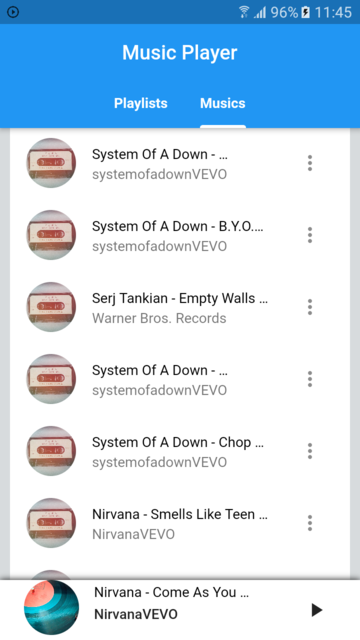

# Music Player

A flutter music app

## About The Project

Music Player is an app that lists all the songs on the local device and allows the user to play them in a normal or random order.

In addition, it is possible to create personalized playlists with your favorite songs that have been saved in a local database.

The app is not in a final version and still has some problems to be solved.

### Built With
These are just a few packages, plus of course the Framework Flutter all implemented in the  language
* [Flutter](https://flutter.dev/)
* [Flutter-AssetsAudioPlayer](https://github.com/florent37/Flutter-AssetsAudioPlayer)
* [StoragePath](https://github.com/follow2vivek/StoragePath)

## Contributing

If you want to contribute to the project, follow the steps below:

1. Fork the Project
2. Create your Feature Branch (`git checkout -b feature/<yourFeatureName>`)
3. Commit your Changes (`git commit -m 'Add some <yourFeatureName>'`)
4. Push to the Branch (`git push origin feature/<yourFeatureName>`)
5. Open a Pull Request

## Contact

Willames Jr. - willamesj11@gmail.com

